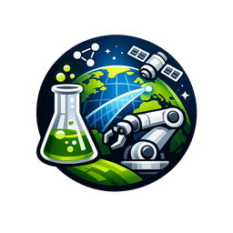

<div align="center">
  

  <h1>世界の自動化実験室マップ</h1>

  <p align="center">
    世界中で動いている自動化実験室（Self-Driving Labs）を手作業でキュレーションしたマップ。国家プロジェクト、研究室、企業、オープンなラボ OS まで含めています。
  </p>

  <p align="center">
    <a href="https://sdl-map.discoverylabs.nl/"><b>🌐 インタラクティブマップを開く →</b></a>
  </p>

  <p align="center">
    <a href="https://awesome.re"></a>
    <a href="https://yetiswang.github.io/sdl-map/"></a>
    <a href="LICENSE"></a>
  </p>

  <p align="center">
    <a href="README.md">English</a> ·
    <a href="README.zh-Hans.md">简体中文</a> ·
    <a href="README.zh-Hant.md">繁體中文</a> ·
    <b>日本語</b> ·
    <a href="README.ko.md">한국어</a>
  </p>
</div>

> 自動化実験室（Self-Driving Lab、SDL）は、AI 駆動の仮説生成、自動化された合成、オンラインキャラクタリゼーションを一つのループに閉じます。このリストは、その仕事を実際にやっている人・プロジェクト・プラットフォームを記録したものです。検索エンジンが拾ったリストではなく、私が見たままの分布図です。2026 年 6 月時点の公開情報に基づき、[インタラクティブマップ](https://sdl-map.discoverylabs.nl/) と連動して継続的に更新しています。

## 📚 目次

- [🌍 国家プロジェクト・コンソーシアム](#-国家プロジェクトコンソーシアム)
- [🎓 学術グループ](#-学術グループ)
- [🏭 商業・産業](#-商業産業)
- [🛰 ラボ OS・オーケストレーション](#-ラボ-osオーケストレーション)
- [📐 データスキーマ](#-データスキーマ)
- [🛠 ローカル開発](#-ローカル開発)
- [🤝 貢献](#-貢献)
- [📜 ライセンス](#-ライセンス)

> **翻訳について：** 項目名、機関名、リンク、および一文の説明は英語のまま残しています（多くの研究プロジェクトは英語を共通言語としています）。本ドキュメントでは見出し、章立て、運用ガイドを翻訳しています。完全な項目リストは [English README](README.md) を参照してください。

---

## 🌍 国家プロジェクト・コンソーシアム

公的セクター主導、複数機関にまたがる国家規模・地域規模の SDL プロジェクト。Acceleration Consortium、BIG-MAP / FULL-MAP、PEPR DIADEM、DiscoveryLabNL ほか全 11 件は [English README → National Programmes & Consortia](README.md#-national-programmes--consortia) を参照。

## 🎓 学術グループ

単一機関または PI が主導し、実際に SDL を動かしている研究グループ。A-Lab、Cooper Group、Jensen Lab、Jun Jiang グループ / ChemAgents + Robot Chemist、嘉庚創新実験室ほか全 27 件は [English README → Academic Groups](README.md#-academic-groups) を参照。

## 🏭 商業・産業

営利の SDL 企業、製薬企業の社内プログラム、および SDL 関連のハードウェア / 計測機器ベンダー。Lila Sciences、XtalPi、Cusp AI、DP Technology / Bohrium ほか全 26 件は [English README → Commercial & Industrial](README.md#-commercial--industrial) を参照。

## 🛰 ラボ OS・オーケストレーション

SDL を動かすためのソフトウェアプラットフォーム、スケジューリング層、装置接続標準。Automata LINQ、Benchling、Artificial、Atinary ほか全 10 件は [English README → Lab OS & Orchestration](README.md#-lab-os--orchestration) を参照。

---

## 📐 データスキーマ

項目データは [`index.html`](./index.html) にインライン埋め込み（`window.SDL_DATA = [...]` を検索）。各エントリの構造：

```js
{
  id: "aria",                    // 短い ID
  name: "UK ARIA AI Scientists", // 表示名
  org: "ARIA",                   // 所属組織
  city: "London",
  country: "UK",
  flag: "🇬🇧",
  lat: 51.51, lon: -0.13,
  tier: "national",              // national | academic | commercial | labos
  domain: "cross-domain",        // chemistry | materials | energy | biology | batteries | drug-discovery | orchestration | cross-domain
  maturity: "prototype",         // concept | prototype | operational | industrial
  charact: "single-technique",   // synthesis-only | single-technique | multi-technique | advanced-multimodal
  ai: "strong",                  // strong | partial | planned | none
  scale: "national",
  invest: 8,                     // 推定投資額（百万米ドル単位、マップ上の重み付けに使用）
  investLabel: "£6M",
  url: "https://aria.org.uk/",
  sources: ["..."]
}
```

## 🛠 ローカル開発

```bash
git clone https://github.com/yetiswang/sdl-map.git
cd sdl-map
python3 -m http.server 8000
```

`http://localhost:8000/` を開く（`index.html` がロードされます）。直接編集して commit + push すれば GitHub Pages 経由でデプロイされます。

## 🤝 貢献

訂正、追加、改名・終了の報告を歓迎します。Issue または PR をお送りください。新項目は以下を含めてください：

- **名称 + 所属組織 + 所在地**（緯度経度付き）。
- **主 URL**（実際に解決すること。ドメインパーキングへのリダイレクトは不可）。
- **区分**（national / academic / commercial / labos）、**分野**、**成熟度**、**ループ内キャラクタリゼーション**、**AI**。
- **出典**（2〜3 件の信頼できるリンク：機関プレスリリース、査読付き論文、公的助成のアナウンスなど）。

レビューが入りやすいパターン：リンク切れ、改名・買収に未追従、スコープのずれ、終了したのに後継のないプロジェクト。

## 📜 ライセンス

ソースは [MIT](./LICENSE) で公開。内容（項目データと説明）はコンパイル時点での公開情報を反映しています。
